# IBM ACE CI/CD with Tekton

**Table of contents**

- [Setup OpenShift Pipelines Operator](#setup-tekton)
- [Demo scenario](#demo-scenario)
- [Relationship between Tekton objects](#tekton-objects)
- [Objects descriptions](#objects-descriptions)
  - [Pipeline resources](#desc-resources)
  - [Tasks](#desc-tasks)
  - [Pipeline](#desc-pipeline)
  - [Trigger template](#desc-trigger)
  - [Event listener](#desc-listener)
  - [Route](#desc-route)
- [Create objects](#create-objects)  
- [Setup a webhook for GitHub repo](#webhook-setup)
- [Run deployment](#run-deployment)
  - [Sample Dockerfile](#docker-sample)
  - [Sample Integration Server YAML](#yaml-sample)
  - [Service account](#service-account)
- [Recommended reading](#recommended-reading)


&nbsp;

<a name="setup-tekton"></a>

## Setup OpenShift Pipelines Operator

Tekton is a Kubernetes native open-source framework for implementing continuous integration and continuous delivery solutions (CI/CD). The OpenShift implementation is called OpenShift Pipelines and it is available as an Operator in the Operators catalog.  

- You can search the keyword "Tekton" in the catalog. Install the OpenShift Pipelines Operator (if not already installed):

  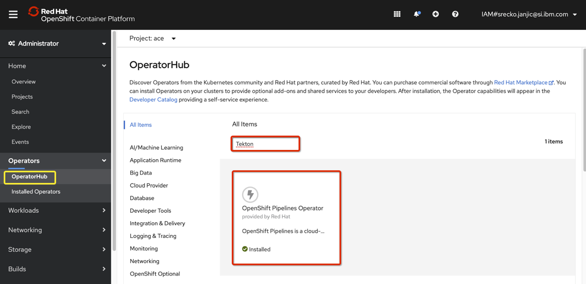

- Once installed, the OpenShift Pipeline Operator provides additional Kubernetes object types like Pipelines, Tasks and Pipeline Resources.  

  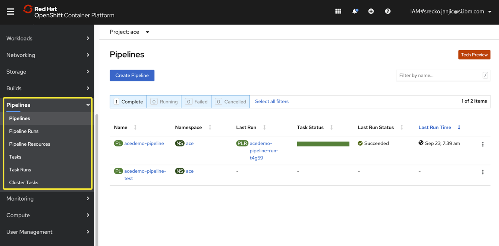


&nbsp;

<a name="demo-scenario"></a>

## Demo scenario

- This is a high leve description of the demo scenario:

  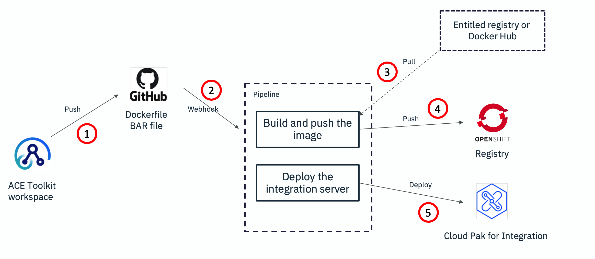

1. We start the process by pushing the content of ACE toolkit workspace to the GitHub. Please see the following documet for the instructions how to connect Toolkit with GitHub: [Setup ACE Toolkit to work with GitHub](https://github.ibm.com/srecko-janjic/CP4I-ACE-CI-CD-Toolkit-setup)
2. GitHub uses a predefined webhook to send the information about the changes to the Tekton event listener which starts the *pipeline run*.
3. The first task in the pipeline pulls the base ACE Docker image from the entitled registry or the Docker Hub.

  - If the entitled registry is used then the proper secret must exist in the namespace where the instance is created. If this is the same namespace as for the ACE Dashboard then the secret already exists. If you deploy in a different namespace then you have to create the secret. Please follow those instructions: [IBM Entitled Registry entitlement keys](https://www.ibm.com/support/knowledgecenter/SSTTDS_11.0.0/com.ibm.ace.icp.doc/certc_install_ibmentitledregistryentitlementkeys.html). 

  - If you pull the image from the public registry then the entitled key is not needed. Please be aware that you can be affected by the following limitation: [Docker Hub rate limiting](https://www.docker.com/increase-rate-limits).

4. The same task builds a new image by adding the ACE BAR file and stores this new image to the local OpenShift’s registry.
5. The second task takes the image from the local registry and calls the App Connect Operator which is part of the Cloud Pak for Integration to create and Integration Server instance (Kubernetes CR)


&nbsp;

<a name="tekton-objects"></a>

## Relationship between Tekton objects

- The demo includes the following Tekton objects:
  * Pipeline definition which contains two tasks: build and deploy. The pipeline itself and both tasks are abstractly defined so that they are independent of the particular case and can be reused
  * Two Tekton resource definitions: one of the git type which points to the specific GitHub repo and the other of the image type which defines the specific Docker image
  * Pipeline Run definition which binds the abstract pipeline and task definitions with the specific resources
  * The Event Listener starts an instance of the Pipeline Run using Trigger Template and it is exposed to the outside world using the OpenShift route so that the GitHub repo can call it using its Webhook mechanism.

  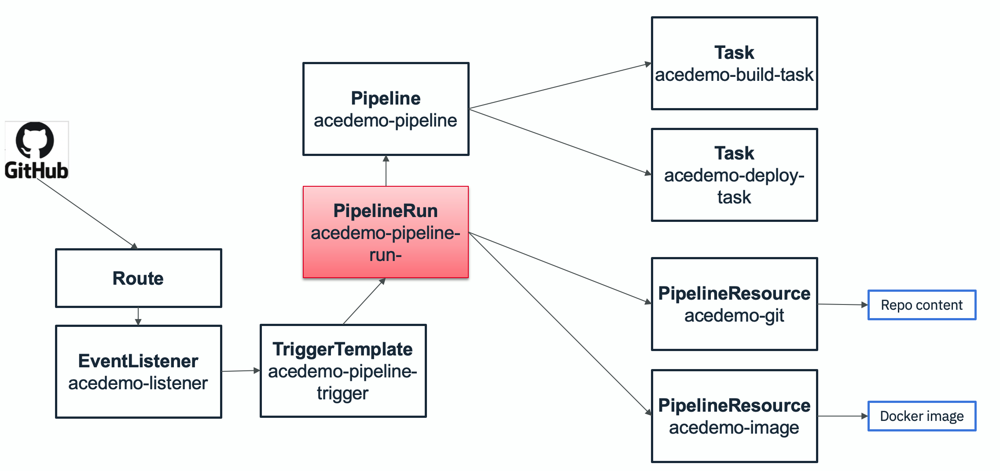


&nbsp;

<a name="objects-descriptions"></a>

## Objects descriptions

This chapter describes some details of the structure of objects that appear in the demo scenario.
The yaml files with the definitions of the described objects are available in the [yamls](yamls) directory of this repository. A direct link to the yaml file is provided below at each object description. 

<a name="desc-resources"></a>

### Pipeline resources

The pipeline resources represent concrete artifacts that can be defined in the input and output parameters of the pipeline tasks. Those are typically Git repositories and container images. For example, a typical task for building the image will take the Git repository as an input source and will create an image as a result. 

There are two resources in our demo scenario:

- **acedemo-git** which is of the **git** resource type (see [git-resource.yaml](yamls/git-resource.yaml))  

  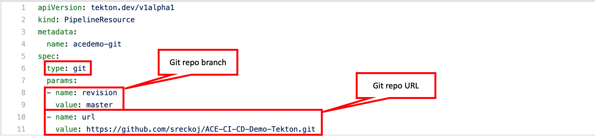

- **acedemo-image** which of the **image** resource type (see [image-resource.yaml](yamls/image-resource.yaml))

  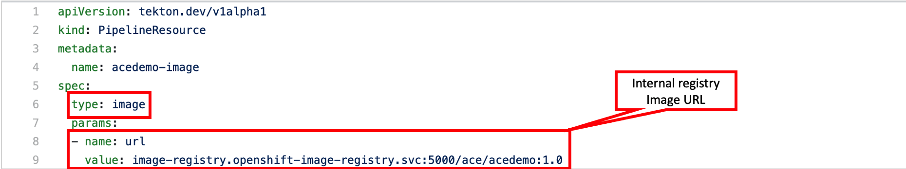

<a name="desc-tasks"></a>

### Tasks

Tasks are the basic building blocks of the pipeline. Each task is executed in its own pod. Each task can consist of one or more steps.

Ther are two tasks in the example:

- **acedemo-build-task** - used to build and push the image (see [build-task.yaml](yamls/build-task.yaml)) 
  This task consists of two steps, one to build the image and the other to push it to the registry. 
  There are several different possibilities to build the image. In this case, we use **buildah** tool for both steps (https://buildah.io/).

  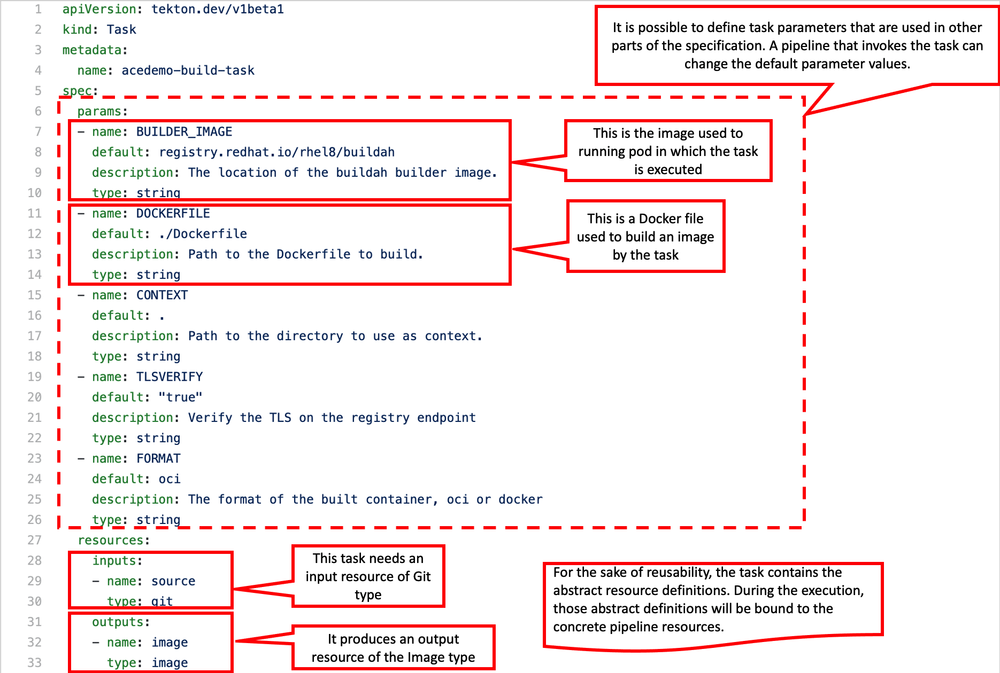  
  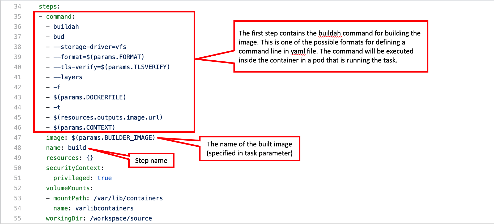
  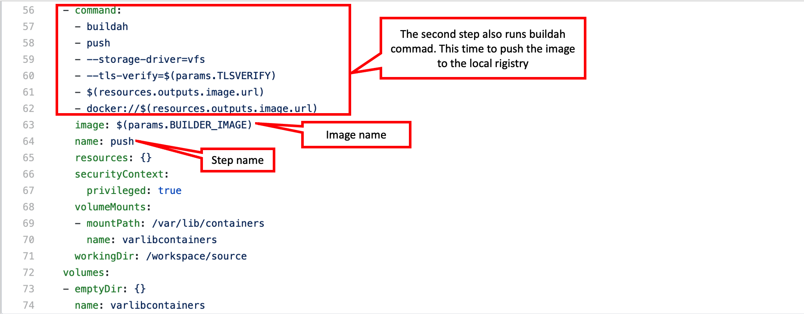


- **acedemo-deploy-task** - used to deploy the Integration Server using the custom image built in the previous task. For runing deployment we use image with the OC command line (quay.io/openshift/origin-cli:latest)

  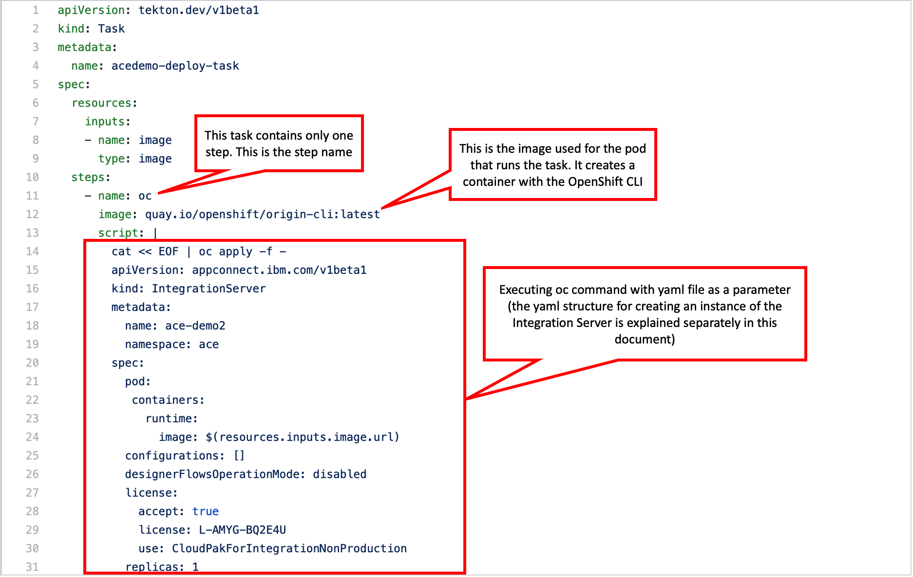


<a name="desc-pipeline"></a>

### Pipeline

- The pipeline **acedemo-pipeline** created in this example is declared in the file [pipeline.yaml](yamls/pipeline.yaml). It contains two resource definitions and references two tasks. Note that resource definitions are abstract. They will be bound to the real resources during the pipeline execution. 

  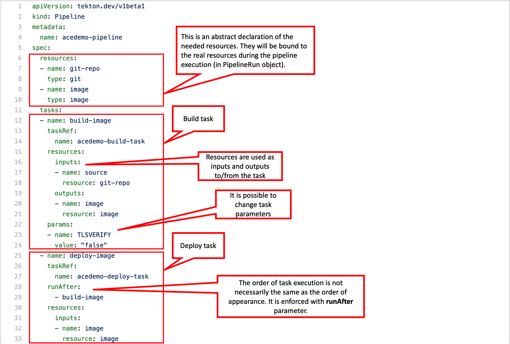  


<a name="desc-trigger"></a>

### Trigger template

To execute Task or Pipeline a TaskRun, or PipelineRun objects are needed. They define how the Task or Pipeline is executed. Please see the recommended reading list at the end of this page for additional details. In our example here, we will create a trigger template that contains a template for the PipelineRun that will be used for the Pipeline execution when some change happens on a GitHub repository. 

- The trigger template **acedemo-pipeline-trigger** used in this example is defined in [trigger-template.yaml](yamls/trigger-template.yaml)

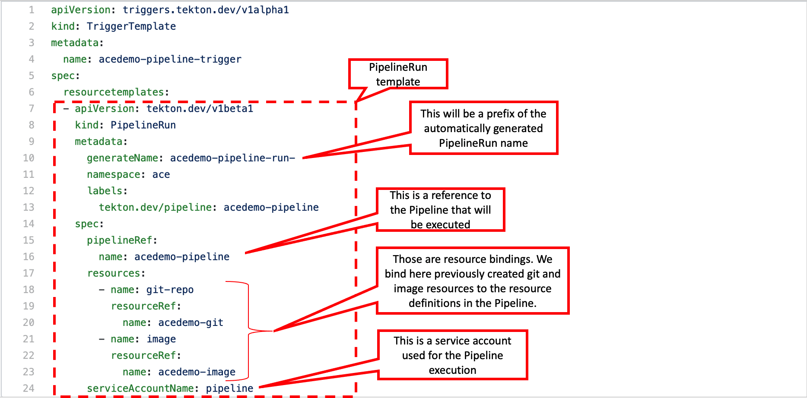


<a name="desc-listener"></a>

### Event listener

The Event Listener object is typically used in combination with Git webhook to invoke the Pipeline Trigger when some change in the repository happens. 

- A sample listener **acedemo-listener** is available in [event-listener.yaml](yamls/event-listener.yaml)

  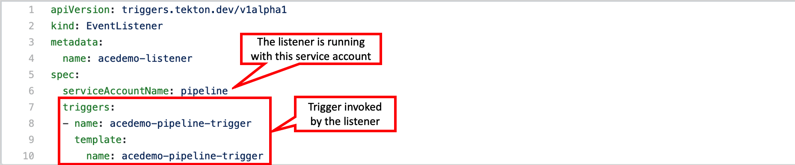

- As a result of creating an Event Listener object, a Deployment and running pod are created. The pod actually listens to the incoming events and starts Pipeline Run using Pipeline Trigger.

  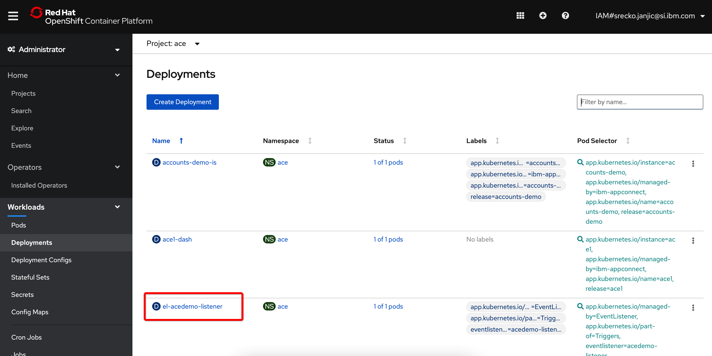

  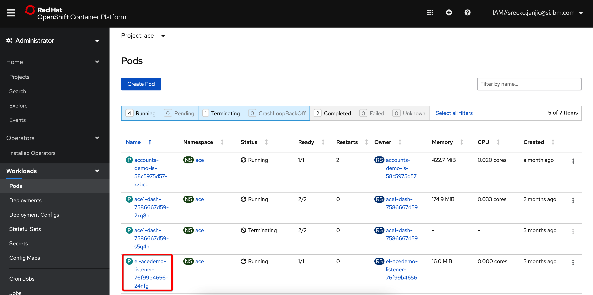


<a name="desc-route"></a>

### Route

- The route **acedemo-webhook** exposes service previously created by the Event Listener (see [route.yaml](yamls/route.yaml))

  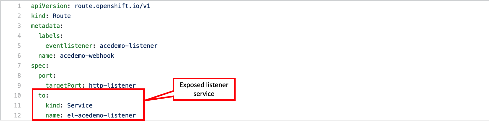

&nbsp;

<a name="create-objects"></a>

## Create objects

You can create the pipeline objects from the command line interface by preparing the yaml files and executing thems with `oc create -f <file-name>` or by clicking on the "plus" icon in the toolbar of the OpenShift console and pasting the yaml structure.

  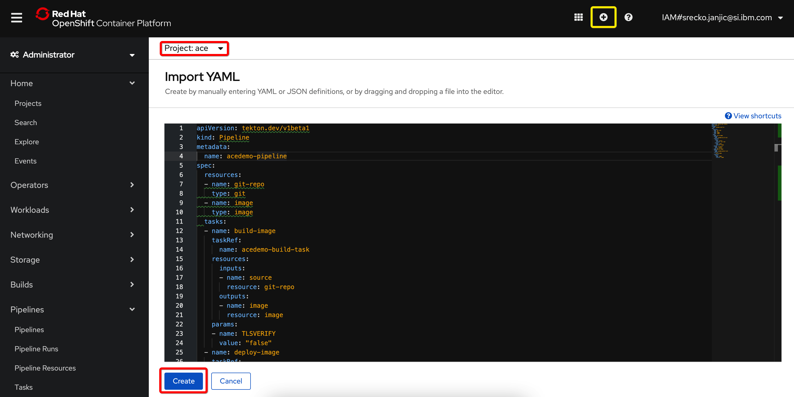

In our example, the pipeline objects are created in the same project as the ACE dashboard.

As the result, objects appear under Pipeline section:

  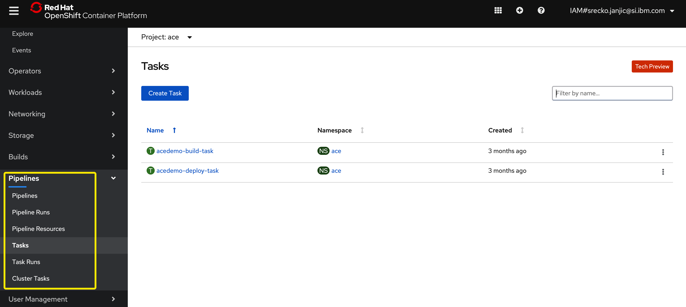


&nbsp;

<a name="webhook-setup"></a>

## Setup a webhook for GitHub repo

It is possible to define a webhook in the Git repository to start the pipeline when some change happens (when new content is pushed to the repository). 

- Navigate to **Networking > Routes** in the project where the Event Listener is deployed and click on the previously created route:

  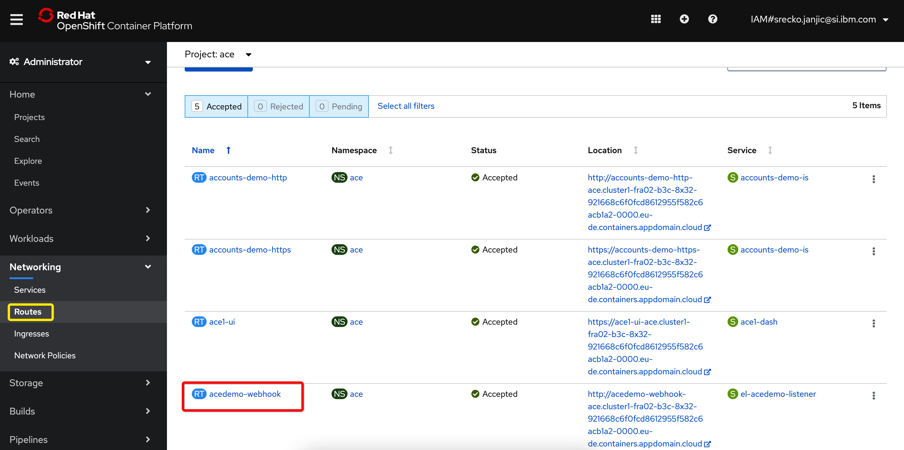

- Find and copy the route URL:

  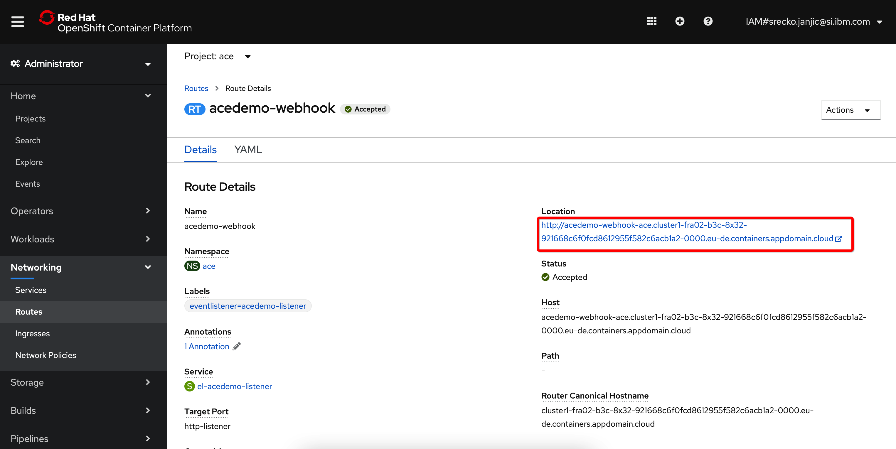

- Go to the Git repository and click on **Settings**

  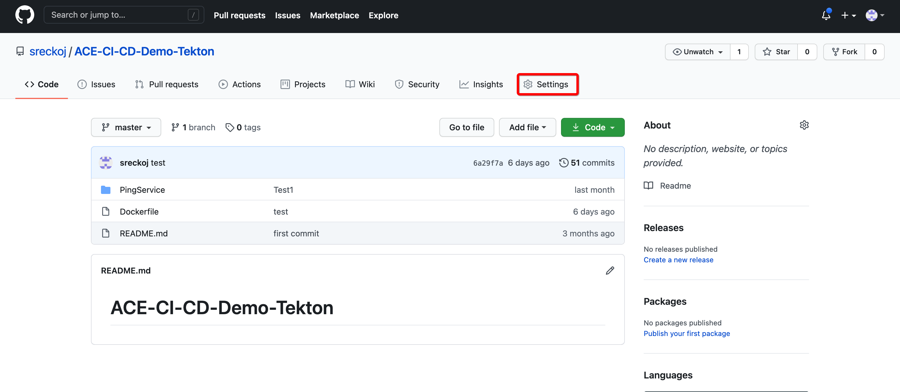

- Then select **Webhooks**

  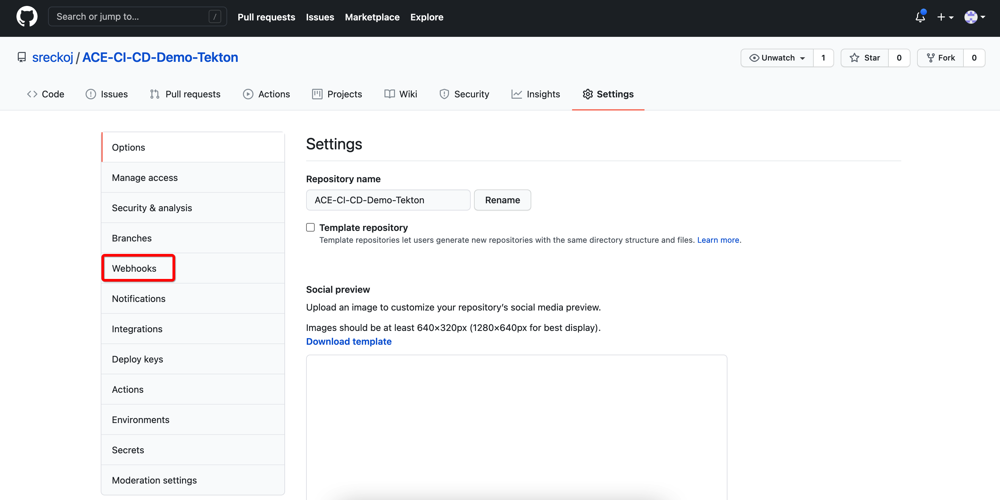

- And create a new webhook using the previously copied route URL

  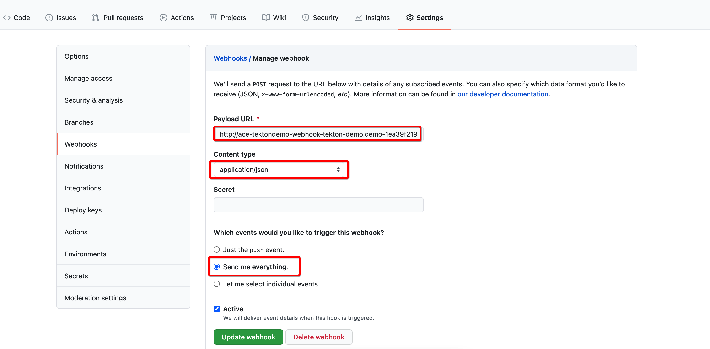

&nbsp;

<a name="run-deployment"></a>

## Run deployment

A sample GitHub repository used in this demo is available here: [ACE-CI-CD-Demo-Tekton](https://github.com/sreckoj/ACE-CI-CD-Demo-Tekton)
If the git push is executed against this repository, the webhook URL will be used to send the content to the Tekton Pipeline Listener pod. The pod will start the execution of the PipelineRun. 

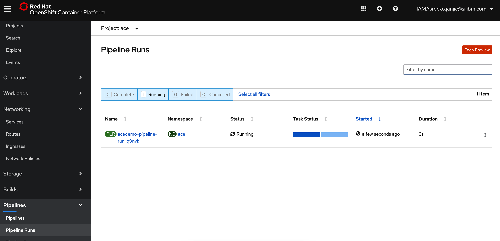

If you click on the PipelineRun, you can observe the execution of the tasks...

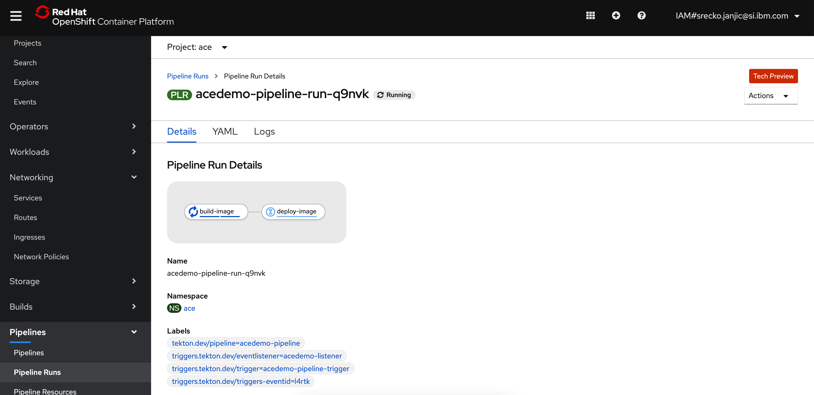

and if you click on the task, you can observe the execution of the steps in the task logs:

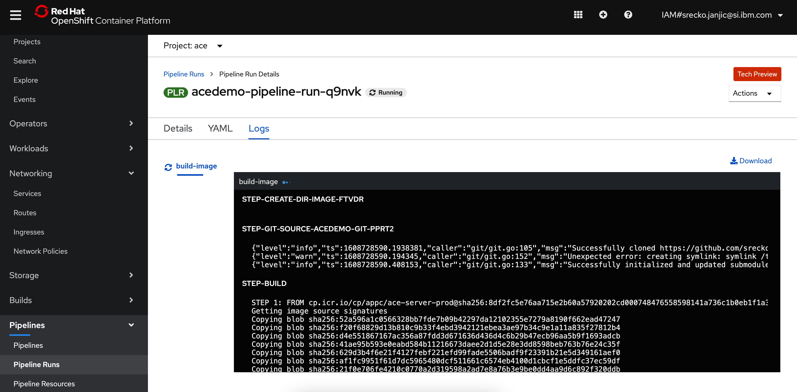

For the instructions on how to setup integration between GitHub and ACE Toolkit please see the following document: [Setup ACE Toolkit to work with GitHub](https://github.ibm.com/srecko-janjic/CP4I-ACE-CI-CD-Toolkit-setup)

<a name="docker-sample"></a>

### Sample Dockerfile

This is a Dockerfile used in the example:

```Dockerfile
#FROM ibmcom/ace-server:latest
#FROM ibmcom/ace-server:11.0.0.9-r3-20200724-030239-amd64
FROM cp.icr.io/cp/appc/ace-server-prod@sha256:8df2fc5e76aa715e2b60a57920202cd000748476558598141a736c1b0eb1f1a3
ENV LICENSE accept
COPY PingService /home/aceuser/PingService
RUN mkdir /home/aceuser/bars
RUN source /opt/ibm/ace-11/server/bin/mqsiprofile
RUN /opt/ibm/ace-11/server/bin/mqsipackagebar -a bars/PingService.bar -k PingService
RUN ace_compile_bars.sh
RUN chmod -R 777 /home/aceuser/ace-server/run/PingService
```

- Please note that the base image can be pulled from the public or entitled registry. 
- If the entitled registry is used then the proper secret must exist in the namespace where the instance is created. If this is the same namespace as for the ACE Dashboard then the secret already exists. If you deploy in a different namespace then you have to create the secret. Please follow those instructions: [IBM Entitled Registry entitlement keys](https://www.ibm.com/support/knowledgecenter/SSTTDS_11.0.0/com.ibm.ace.icp.doc/certc_install_ibmentitledregistryentitlementkeys.html). 
- If you pull the image from the public registry then the entitled key is not needed. Please be aware that you can face the [Docker Hub rate limiting](https://www.docker.com/increase-rate-limits).
- Please note that the project is copied to the image and that the BAR file is created during the image build. 
- The last row with the chmod command is a workaround for solving the problem with the permissions when deployed on OpenShift using the Cloud Pak Operators. The ACE containers by default run with aceuser identity, but when deployed using Operators they run with a dynamically created user that does not have access rights to the project directory inside the container (probably there is a better solution for that than the one used here). 

<a name="yaml-sample"></a>

### Sample Integration Server YAML

This is a YAML structure provided as a parameter to the `oc` command in the deploy task: 

```yaml
apiVersion: appconnect.ibm.com/v1beta1
kind: IntegrationServer
metadata:
  name: ace-demo2
  namespace: ace
spec:
  pod:
    containers:
      runtime:
        image: $(resources.inputs.image.url)
  configurations: []
  designerFlowsOperationMode: disabled
  license:
    accept: true
    license: L-AMYG-BQ2E4U
    use: CloudPakForIntegrationNonProduction
  replicas: 1
  router:
    timeout: 120s
  service:
    endpointType: http
  useCommonServices: true
  version: 11.0.0
```

Please note the difference comparing to the yaml when we deploy from the ACE Dashboard. Instead of the uploaded BAR, we are referring here to the custom image in the internal OpenShift's registry (in this case even to the input parameter of the deploy task). The final result should be tha same - an instance of the running Integration Server visible in the ACE dashboard.

<a name="service-account"></a>

### Service account

When we run the Tekton operator to install the OpenShift Pipelines, the service account called **pipeline** was created.
It is sufficient for running the pipelines in cases similar to the one described here. In our situation, the pipeline was executed in the same namespace where the Integration Server was deployed. In situations where we run the pipeline in the namespace which is different than the target namespace, the service account used for running the pipeline needs privileges to build images and deploy applications in the target namespace. A very good description of how to configure that can be found in the additional reading below.  


&nbsp;

<a name="recommended-reading"></a>

## Recommended reading

- https://medium.com/@jerome_tarte/first-tasks-with-tekton-on-ibm-cloud-pak-for-application-88c8f496723d
- https://medium.com/@jerome_tarte/first-pipeline-with-tekton-on-ibm-cloud-pak-for-application-e82ea7b8a6b1
- https://github.com/wtistang/tekton-lab
- https://www.ibm.com/cloud/garage/dte/tutorial/cloud-native-use-case-using-tekton-pipelines-cicd-microservices


&nbsp;
